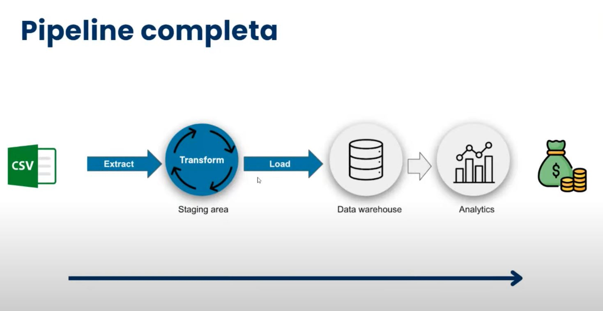
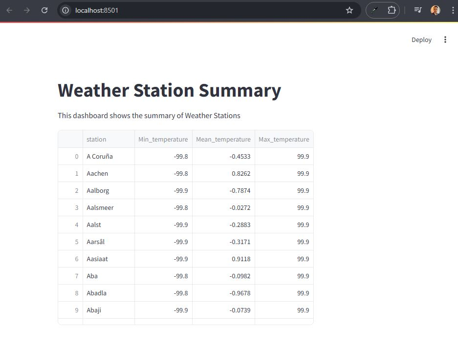

# ETL - One Billion Row Challenge

**Python x Pandas x Spark x Dask x Polars x DuckDB**



## Introduction

The goal of this project is to demonstrate how to efficiently process a massive data file containing 1 billion rows (~15GB), specifically to calculate statistics (including aggregation and sorting, which are heavy operations) using Python, Dask, Polars, DuckDB.

***This challenge was inspired by the The One Billion Row Challenge, originally proposed for Java. Project developed in the Data Engineering course (Jornada De Dados).***

The data file consists of temperature measurements from various weather stations. Each record follows the format `<string: station name>;<double: measurement>`, with the temperature presented to one decimal place.

Here are ten example lines from the file:

```
Hamburg;12.0
Bulawayo;8.9
Palembang;38.8
St. Johns;15.2
Cracow;12.6
Bridgetown;26.9
Istanbul;6.2
Roseau;34.4
Conakry;31.2
Istanbul;23.0
```

The challenge is to develop a Python program capable of reading this file and calculating the minimum, mean (rounded to one decimal place), and maximum temperature for each station, displaying the results in a table sorted by station name.

| station      | min_temperature | mean_temperature | max_temperature |
|--------------|-----------------|------------------|-----------------|
| Abha         | -31.1           | 18.0             | 66.5            |
| Abidjan      | -25.9           | 26.0             | 74.6            |
| Abéché       | -19.8           | 29.4             | 79.9            |
| Accra        | -24.8           | 26.4             | 76.3            |
| Addis Ababa  | -31.8           | 16.0             | 63.9            |
| Adelaide     | -31.8           | 17.3             | 71.5            |
| Aden         | -19.6           | 29.1             | 78.3            |
| Ahvaz        | -24.0           | 25.4             | 72.6            |
| Albuquerque  | -35.0           | 14.0             | 61.9            |
| Alexandra    | -40.1           | 11.0             | 67.9            |
| ...          | ...             | ...              | ...             |
| Yangon       | -23.6           | 27.5             | 77.3            |
| Yaoundé      | -26.2           | 23.8             | 73.4            |
| Yellowknife  | -53.4           | -4.3             | 46.7            |
| Yerevan      | -38.6           | 12.4             | 62.8            |
| Yinchuan     | -45.2           | 9.0              | 56.9            |
| Zagreb       | -39.2           | 10.7             | 58.1            |
| Zanzibar City| -26.5           | 26.0             | 75.2            |
| Zürich       | -42.0           | 9.3              | 63.6            |
| Ürümqi       | -42.1           | 7.4              | 56.7            |
| İzmir        | -34.4           | 17.9             | 67.9            |

## Dependencies
To run the scripts in this project, you will need the following libraries:

* Python = `3.12`
* Pandas = `2.2.2`
* Tqdm = `4.66.5`
* Duckdb = `1.1.0`
* Streamlit = `1.38.0`
* Pyspark = `3.5.2`
* Dask = `2024.9.0`
* Polars = `1.7.1`


## Results
The tests were conducted on a laptop equipped with an Apple M1 processor and 8GB of RAM. The implementations used pure Python, Pandas, Dask, Polars, and DuckDB approaches. The runtime results for processing the 1 billion-row file are presented below:

| Implementation | Time |
| --- | --- |
| Bash + awk | 25 minutos |
| Python | 20 minutos |
| Python + Pandas | 263 sec |
| Python + Dask | 155.62 sec  |
| Python + Polars | 33.86 sec |
| Python + Duckdb | 14.98 sec |

## Conclusion

This challenge clearly highlighted the effectiveness of various Python libraries in handling large volumes of data. Traditional methods such as Bash (25 minutes), pure Python (20 minutes), and even Pandas (5 minutes) required a series of tactics to implement "batch" processing, while libraries like Dask, Polars, and DuckDB proved to be exceptionally efficient, requiring fewer lines of code due to their inherent ability to distribute data in "streaming batches" more effectively. DuckDB stood out, achieving the fastest runtime thanks to its execution and data processing strategy.

These results emphasize the importance of selecting the right tool for large-scale data analysis, demonstrating that Python, with the right libraries, is a powerful choice for tackling big data challenges.

DuckDB also wins with 1 million rows, truly the best.

## How to Run

To run this project and reproduce the results:

1. Clone this repository
2. Set the Python version using `pyenv local 3.12.1`
3. Use `poetry env use 3.12.1`, `poetry install --no-root`, and `poetry lock --no-update`
4. Run the command `python create_measurements.py` to generate the test file (is possible to edit the number of rows in the file)
5. Run the command `python etl_pytnon.py` to perform the data transformation
6. Make sure to install the specified versions of Dask, Polars, and DuckDB libraries
7. Run the scripts `python src/using_python.py`, `python src/using_pandas.py`, `python src/using_dask.py`, `python src/using_polars.py`, and `python src/using_duckdb.py` through a terminal or a Python-supported development environment.
8. Run `streamlit run dashboard/dashboard.py` to view the dashboard in a web application.

This project highlights the versatility of the Python ecosystem for data processing tasks, offering valuable lessons on tool selection for large-scale analysis.



## Bonus

To run the described Bash script, you need to follow a few simple steps. First, ensure that you have a Unix-like environment, such as Linux or macOS, which natively supports Bash scripts. Additionally, check if the tools used in the script (`wc`, `head`, `pv`, `awk`, and `sort`) are installed on your system. Most of these tools come pre-installed on Unix-like systems, but `pv` (Pipe Viewer) may need to be installed manually.

### Installing Pipe Viewer (pv)

If you don't have `pv` installed, you can easily install it using your system's package manager. For example:

* On Ubuntu/Debian:
    
    ```bash
    sudo apt-get update
    sudo apt-get install pv
    ```
    
* On macOS (using [Homebrew](https://brew.sh/)):
    
    ```bash
    brew install pv
    ```

### Preparing the Script
 
1. Grant execution permission to the script file. Open a terminal and run:
    
    ```bash
    chmod +x process_measurements.sh
    ```

2. Run the script. Open a terminal and run:
   
   ```bash
   ./src/using_bash_and_awk.sh 1000
   ```

In this example, only the first 1000 lines will be processed.

When running the script, you will see the progress bar (if `pv` is correctly installed) and eventually the expected output in the terminal or in an output file, if you choose to modify the script to direct the output.
